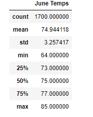
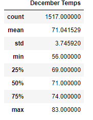

# Surfs Up Analysis

## Overview 
### The purpose of this analysis is to review weather conditions on the island of Oahu. This analysis was performed to convince investors that a Surf n' Shake shop is a viable business. We used an SQLite database as our source for weather data. We then leveravged the power of SQLAlchemy to query the data and build a dataframe. 

## Results
### We focused on observations made for the months of June and December (historically). The results indicated that the average temperature is in the 70s. See Below:

## Summary
### In summary, there are no "bad weather" months on the island of Oahu. The temperatures are consisant year round and rainfall is inconsequential. This appaers to be the perfect place for a Surf n Shake Shop.  
